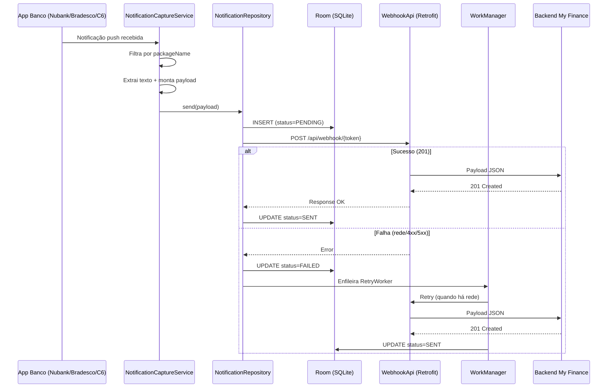

# 1. Arquitetura do My Finance Notifier

---

## 1.1 Visão Geral

O **My Finance Notifier** é um app Android nativo que substitui o MacroDroid na captura de notificações bancárias. Ele escuta notificações dos apps de banco instalados no dispositivo e envia o texto bruto via HTTP POST para o webhook do backend My Finance.

```
┌─────────────────────────────────────────────────────────┐
│                    Android Device                        │
│                                                         │
│  ┌──────────┐  ┌──────────┐  ┌──────────┐             │
│  │ Nubank   │  │ Bradesco │  │ C6 Bank  │  Apps Banco  │
│  └────┬─────┘  └────┬─────┘  └────┬─────┘             │
│       │              │              │                    │
│       ▼              ▼              ▼                    │
│  ┌──────────────────────────────────────┐               │
│  │  NotificationCaptureService          │               │
│  │  - Filtra por packageName            │               │
│  │  - Extrai texto da notificação       │               │
│  │  - Monta WebhookPayload             │               │
│  └──────────────────┬───────────────────┘               │
│                     │                                    │
│                     ▼                                    │
│  ┌──────────────────────────────────────┐               │
│  │  NotificationRepository              │               │
│  │  - Salva log no Room (PENDING)       │               │
│  │  - Envia via Retrofit                │               │
│  │  - Atualiza status (SENT/FAILED)     │               │
│  └────────┬─────────────────┬───────────┘               │
│           │                 │                            │
│     ┌─────▼─────┐    ┌─────▼──────┐                    │
│     │   Room    │    │ WorkManager │                    │
│     │ (SQLite)  │    │ RetryWorker │                    │
│     │ Log/Hist. │    │ Backoff     │                    │
│     └───────────┘    └─────────────┘                    │
│                                                         │
│  ┌──────────────────────────────────────┐               │
│  │  UI (Jetpack Compose)                │               │
│  │  - Configurações (URL, bancos)       │               │
│  │  - Histórico (log de envios)         │               │
│  │  - Permissões (onboarding)           │               │
│  └──────────────────────────────────────┘               │
└────────────────────────┬────────────────────────────────┘
                         │ HTTPS POST
                         ▼
┌────────────────────────────────────────────────────────┐
│  Backend My Finance (VPS)                              │
│  POST /api/webhook/{token}                             │
│  { "banco": "nubank", "texto": "...", "dataHora": N } │
│  → 201 Created                                         │
└────────────────────────────────────────────────────────┘
```

---

## 1.2 Fluxo de Dados



---

## 1.3 Componentes e Responsabilidades

| Componente | Responsabilidade |
|---|---|
| `NotificationCaptureService` | Escuta notificações do Android, filtra bancos, extrai texto, delega envio |
| `NotificationRepository` | Orquestra: salva log local → envia HTTP → atualiza status → agenda retry |
| `WebhookApi` | Interface Retrofit para chamadas HTTP ao backend |
| `RetryWorker` | WorkManager worker que retenta envios falhados com backoff exponencial |
| `AppDatabase` (Room) | Persiste histórico de notificações enviadas/falhadas |
| `SettingsDataStore` | Persiste configurações do usuário (URL, token, bancos habilitados) |
| `MainViewModel` | Gerencia estado da UI (settings + log) |
| `SettingsScreen` | Tela de configuração (webhook URL, token, seleção de bancos) |
| `LogScreen` | Tela de histórico (lista de notificações com status) |
| `PermissionScreen` | Onboarding para conceder acesso a notificações |

---

## 1.4 Contrato com o Backend

**Endpoint:** `POST {baseUrl}/api/webhook/{token}`

**Request Body:**
```json
{
  "banco": "nubank",
  "texto": "Compra de R$ 45,90 APROVADA em MERCADO XYZ",
  "dataHora": 1711324800000
}
```

**Respostas:**

| Código | Significado |
|---|---|
| `201` | Notificação processada com sucesso |
| `400` | Banco não suportado ou texto não parseável |
| `401` | Token inválido ou inativo |
| `429` | Rate limit excedido (30 req/min por token) |

---

## 1.5 Mapeamento de Bancos

| Banco | Package Name Android | Chave (`banco`) |
|---|---|---|
| Nubank | `com.nu.production` | `nubank` |
| Bradesco | `com.bradesco` | `bradesco` |
| C6 Bank | `com.c6bank.app` | `c6` |
